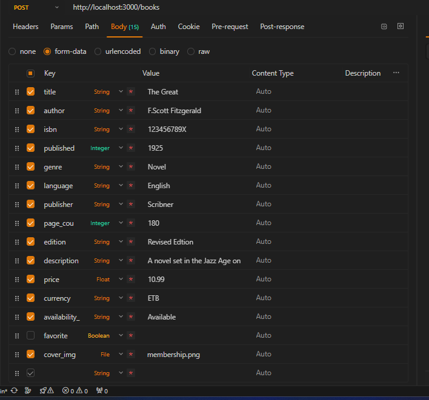
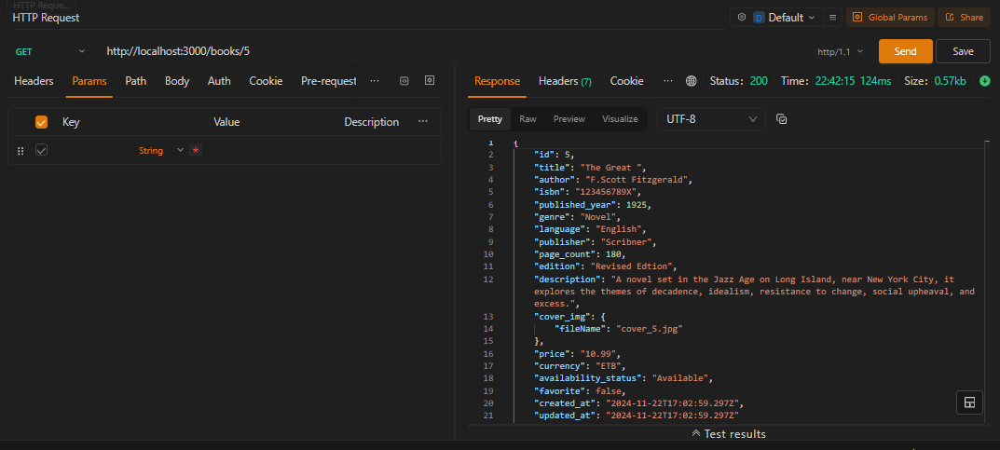
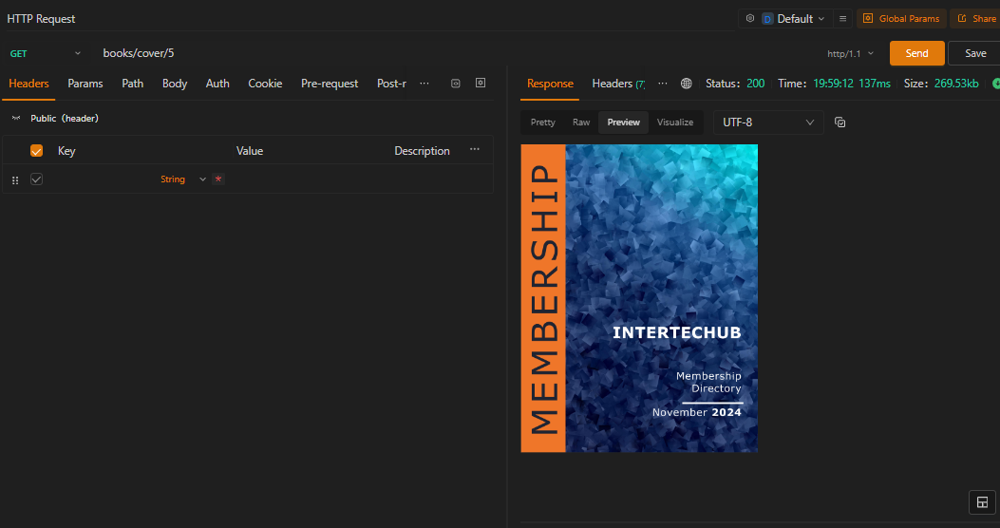

# Books Collection API

A RESTful API for managing a collection of books, including functionality for CRUD operations, recommendations, and favorite books management.
 ## [Found Live Demo Here](https://bookscollectionapi.onrender.com/)
## Features
- Add, update, retrieve, and delete books.
- Mark books as favorites and remove them from the favorites list.
- Retrieve recommendations and list all favorite books.
- Validates book data, including strict ISBN checks and optional fields.

---

## Validation Rules

### Book Fields
| **Field**           | **Required** | **Description**                                                                 |
|----------------------|--------------|---------------------------------------------------------------------------------|
| `title`             | ✅           | The title of the book.                                                        |
| `author`            | ✅           | The author of the book.                                                       |
| `isbn`              | ✅           | Must be a valid ISBN-10 or ISBN-13 format.                                    |
| `published_year`    | ✅           | A number between 1000 and the current year.                                   |
| `genre`             | ❌           | Optional. A string indicating the genre.                                      |
| `language`          | ❌           | Optional. A string indicating the language (defaults to "English").           |
| `publisher`         | ❌           | Optional. A string for the publisher's name.                                  |
| `page_count`        | ❌           | Optional. A positive integer (defaults to 1).                                 |
| `edition`           | ❌           | Optional. A string (defaults to "1st").                                       |
| `description`       | ❌           | Optional. A string containing the book description.                           |
| `price`             | ❌           | Optional. A decimal with up to two digits after the decimal point.            |
| `currency`          | ❌           | Optional. Must be one of: `ETB`, `USD`, `EUR`, `GBP`, `JPY`.                  |
| `availability_status` | ❌         | Optional. Either `"Available"` or `"Sold"`.                                   |
| `favorite`          | ❌           | Optional. A boolean indicating if the book is marked as favorite.             |
| `cover_img`         | ❌           | Optional. Must be an image file of type JPEG, JPG, PNG, or GIF and ≤2 MB.  else you can get an error   |

---

## API Endpoints

### **1. Add a Book**
**Route:** `POST /books`  
**Description:** Adds a new book to the collection.  
**Validations:**
- All required fields must be provided.
- ISBN must be valid (checked using custom validation). [check Online ISBN checker Here ](https://isbn-checker.netlify.app/)
- Optional fields are sanitized and validated if provided.  
 **Example Request Body:**
   ```json
      {
      "title": "The Great Gatsby",
      "author": "F. Scott Fitzgerald",
      "isbn": "9780141182636",
      "published_year": 1925,
      "genre": "Novel",
      "language": "English",
      "page_count": 180
      } 

### **2. Get All Books**
**Route:** `GET /books`
Description: Fetches a list of all books in the collection.

## **3. Get Book by ID**
**Route:** `GET /books/:id`
Description: Fetches a book by its ID.
- Fetch like `{{URL}}/books/4` this returns books related to id 4 if exist 
- Error Cases: Returns `404` if the book does not exist.
## **4. Get Book Cover Image**
**Route:** `GET /books/cover/:id`
Description: Fetches the cover image of a book by its ID.
-  Fetch like `{{URL}}/books/cover/4` this returns books related to id 4 if exist 
- Error Cases: Returns `404` if the cover image or book does not exist.

## **5. Get Best Recommendations**
**Route:** `GET /books/best/recommendations`
Description: Fetches a list of random three recommended books / if not it fetches 2 0r 1 if the book is not exist in collection you will get an error
## **6. Delete a Book**
**Route:** `DELETE /books/:id`
Description: Deletes a book by its ID.
- `{{URL}}/books/4`  delete books related to id 4
- Error Cases:Returns 404 if the book does not exist.
## **7. Update a Book**
**Route:** `PUT /books/:id`
Description: Updates details of an existing book.
**Validations:**
- All fields are optional, but the values must conform to validation rules.
- ISBN updates must not duplicate an existing ISBN in the database and it must be valid too.
- Error Cases: Returns 404 if the book does not exist.
## **8. Add to Favorite**
**Route:** `PUT /books/add/favorite/:id`
Description: Marks a book as a favorite.
 - `{{URL}}/books/add/favorite/4` this adds books related to id 4
Error Cases:
- Returns 404 if the book does not exist.
- Returns 400 if the book is already marked as favorite.
## **9. Remove from Favorite**
**Route:** `PUT /books/unfavorite/:id`
Description: Removes a book from the favorites list.
- `{{URL}}/books/unfavorite/4` removes books related with id 4
Error Cases:
- Returns 404 if the book does not exist.
- Returns 400 if the book is not marked as favorite.
## **10. Get Favorite Books**
**Route:** `GET /books/get/favorite`
Description: Fetches all books marked as favorite, returning only specific fields:
`title`, 
`author`, 
`isbn`, 
`published_year`,
`genre`, 
`language`, 
`publisher`, 
`page_count`, 
`edition`, 
`description`.

## Setup
### Install Dependencies
    ```
     npm install

## Environment Variables

Create a `.env` file with the following:
- DB_HOST=your_database_host
- DB_USER=your_database_user
- DB_PORT=your_database_port
- DB_PASSWORD=your_database_password
- DB_NAME=your_database_name
## Run the Server
```
    npm start